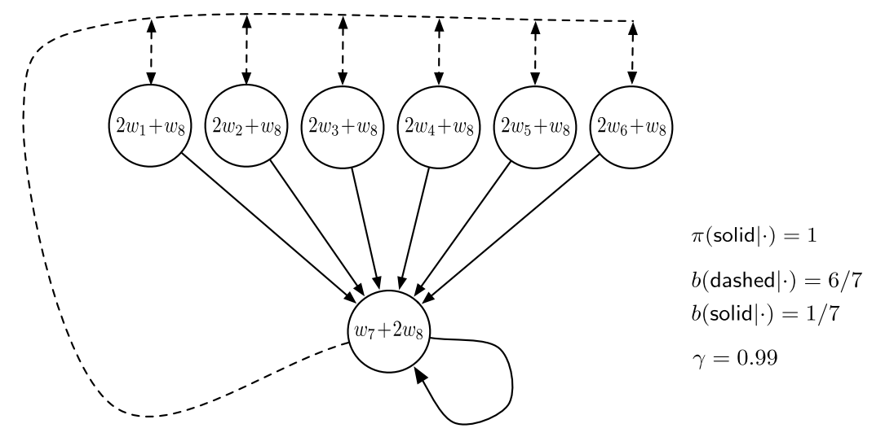

## Examples
Suppose there are two states $s_0, s_1$
which we value as $w$ and $2w$, and only one 
deterministic action `$a : s_0 \rightarrow s_1$`
without reward. When this action occurs, the update does:
`$$
    w_{t+1} = w_t + \alpha \rho_t \left( \gamma \cdot 2 w_t - w_t \right)
$$`
If this does not go unpunished, `$w$` keeps growing, e.g. when `$w_0 = 1$`.

Under _off-policy_ learning, punishment can be avoided.

---

~~~~
data Config = Config
    { alpha    :: Double
    , gamma    :: Double
    , gradient :: Vector (Vector Double)
    , bPolicy  :: Vector Int
    , tPolicy  :: Vector Int
    }
~~~~

---

~~~~
update :: (EnvC e, Env e) => StateE -> Action -> StateE -> ModelEnv e ()
update s a s' = do
                    Config r g grad b p <- ask
                    w                   <- get
                    let rho = importance a b p
                    case (grad !? s, grad !? s') of
                        (Just v, Just v') -> when (V.length v == V.length w)
                                            (do
                                            let c = r * rho * (g * inner v' w - inner v w)
                                            put $ V.zipWith (xplus c) v w
                                            get >>= liftIO . print)
                        _                 -> return ()
                    where xplus a x b = a * x + b
                          inner u z = V.sum $ V.zipWith (*) u z
~~~~